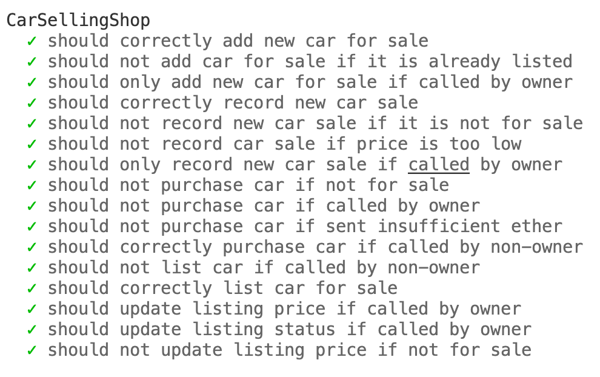
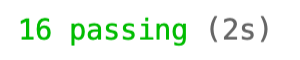

# Solidity Test

Answers to the solidity test questions can be found [here](ANSWERS.md).

To test, deploy and verify contracts the following environment variables must be set:

```shell
export PRIVATE_KEY=""
export INFURA_ID=""
export ETHERSCAN_API_KEY=""
```

```shell
npx hardhat compile
npx hardhat node
npx hardhat test
npx hardhat deploy --network kovan --tags car
npx hardhat verify --network kovan DEPLOYED_CONTRACT_ADDRESS
```



